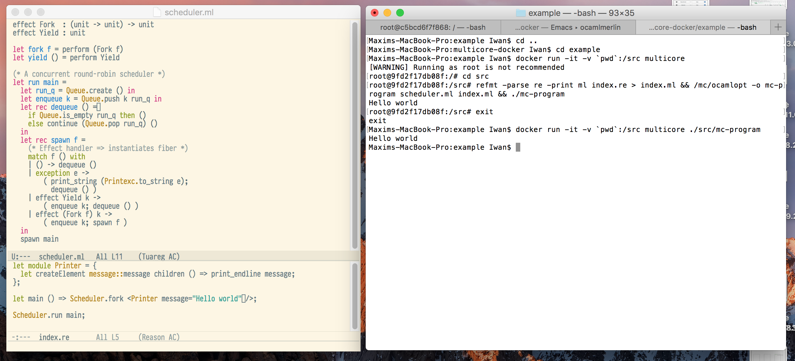

> Jack, having climbed the beanstalk, stands, stranger in a strange land, at the beginning of a road. It stretches in front of him. He cups his hands over his eyes and looks to where it disappears into the hills on the horizon.
> ~ Jack and the Beanstalk

## Reason on Ocaml-Multicore



So you want to try Ocaml-multicore with Reason?
Look no further, this repo gives you the power to sail on a sea of bleeding edge technology.

## Install

```bash
## install docker

git clone https://github.com/IwanKaramazow/reason-multicore

cd reason-multicore

docker build -t multicore .
```

## Usage

Assuming you have your source code under `example` & build the dockerfile from this repo as `multicore`.

```
cd example

docker run -it -v `pwd`:/src multicore

## convert your reason code to ocaml & compile with multicore compiler
refmt -parse re -print ml index.re > index.ml && /mc/ocamlopt -o mc-program scheduler.ml index.ml

## execute result
./mc-program

## or from your host system
docker run -it -v `pwd`:/src multicore ./src/mc-program
```

You can edit the source code from your host machine (in your favourite editor 😉) and build the app in the docker container.
Ocaml-multicore is installed under `/mc`. Opam/Ocaml4.02.3/refmt is available on your path.

Example:
```bash
root@7ae93d69fa82:/# /mc/ocamlopt -v
The OCaml native-code compiler, version 4.02.2+multicore-dev0
Standard library directory: /root/lib/ocaml
root@7ae93d69fa82:/# ocamlopt -v
The OCaml native-code compiler, version 4.02.3
Standard library directory: /root/.opam/4.02.3/lib/ocaml
```

The only caveat at the moment is that you have to print all your reason source code to ocaml.
Currently refmt as `-pp` doesn't support ocaml-multicore's compiler & syntax.
Basically this also means you need to write your algebraic effects in plain ml.
See example directory for an example of what code to write in ocaml/reason.


